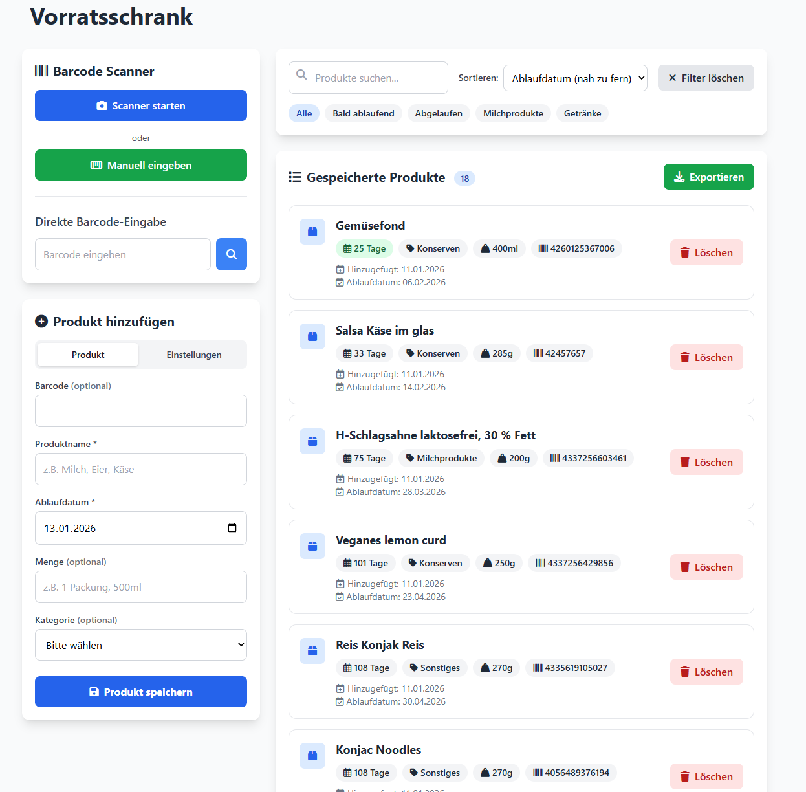

# Home-Assistant-Vorratsschrank-ESP32-E-Paper-Weather-Display-Remix
Dieses Projekt ist eine Abwandlung von [BliBluBlas digitalem Bilderrahmen](https://github.com/bli-blu-bla/e-paper-display) um Inhalte des Vorratsschanks anzeigen zu lassen. Mit dieser Erweiterung können die Inhalte in Homeassitant gespeichert und von dort geladen und auf dem Display angezeigt werden. Es beinhaltet außerdem die Mini-"App" um dies verwalten znu können. Außerdem wurde openfoodfacts angebunden um schneller Daten erfassen zu können.



## In Home Assistant die configuration.yaml erweitern

1. In Home Assistant im Profil unter "Sicherheit" > "Langlebige Zugriffstoken" einen neuen "Token erstellen".

2. Endpunkt zum annehmen von Anfragen der GUI und bei "INSERTAPITOKEN" den Token einfügen.
```yaml
rest_command:
  pantry_save:
    url: "http://localhost:8123/api/services/shell_command/write_pantry_json"
    method: POST
    content_type: "application/json"
    headers:
      Authorization: "Bearer INSERTAPITOKEN"
    payload: '{"json_data": {{ data | to_json }} }'
```

3. Zum Speichern der Anfrage dies über ein Shell Command erledigen lassen.
```yaml
shell_command:
  write_pantry_json: >-
    sh -c 'mkdir -p /config/www/vorratsschrank
    && tmp="/config/www/vorratsschrank/data.tmp.json"
    && printf "%s" '\''{{ json_data | to_json }}'\'' > "$tmp"
    && mv -f "$tmp" /config/www/vorratsschrank/data.json
    && true'
```

4. Ausgehend vom Verzeichnis conf/homeassistant mit dem File Editor neue Verzeichnisse anlegen "/homeassistant/www/vorratsschrank/" und den Inhalt der app dort hochladen (index.html und data.json)
5. In der index.html die Variablen "HA_BASE_URL" und "HA_TOKEN" anpassen an deine Home Assistant Umgebung
6. Home Assistant neustarten
7. Inhalt des displays laden und mit einem USB Kabel die Software auf den ESP laden. Dabei darauf achten die "conf.h" entsprechend anzupassen.
